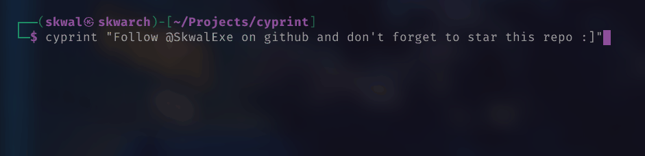
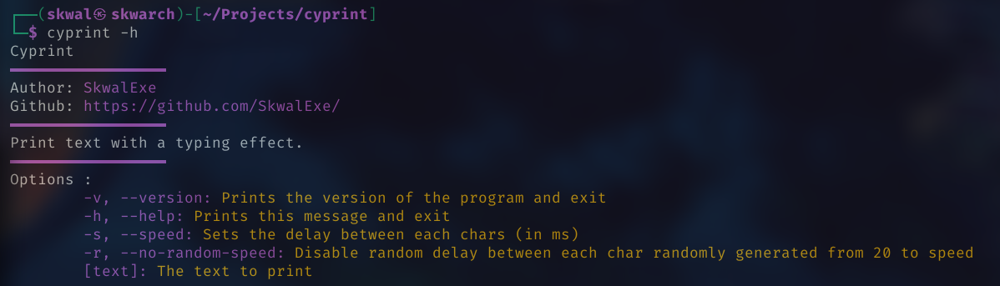

# cyprint ⌨️



⌨️ Print text with a typing effect - Remake of typrint in C 

# Installation 📦

## With make - Linux 🐧

Run make

```bash
# 📂 cyprint/
# build
make 
# add binary to bin folder
make install
```

### Build from source - Linux 🐧 & Windows 🪟

**Clone this repo**

```bash
git clone https://github.com/SkwalExe/cyprint.git
```

build with gcc

```bash
# 📂 cyprint/
gcc src/main.c -o dist/cyprint
```

**[ LINUX ONLY ] :** Move the binary

```bash
# 📂 cyprint/
sudo cp dist/cyprint /usr/bin/cyprint
```

**On windows** the executable will be `dist\cyprint` you can rename it to `cyprint.exe` and move it wherever you want.

# Usage 📝



# Uninstall 🗑

## With make

Run make uninstall

```bash
# 📂 cyprint/
make uninstall
```

## Or

Just remove the binary

```bash
sudo rm /usr/bin/cyprint
```

# final

If you have any problem, don't hesitate to open an issue

# contributing

Pull requests are welcome. For major changes, please open an issue first to discuss what you would like to change.

<a href="https://github.com/SkwalExe#ukraine"></a>